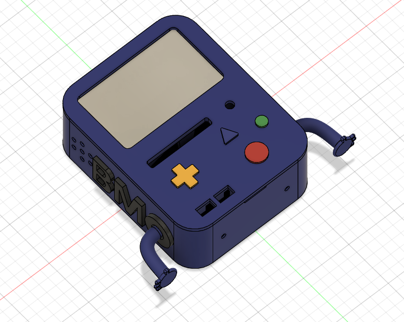

BMO - Adventure Time AI Agent
=============================

<p align="center">
  
  
</p>


Electronics
------------------------

* Raspberry Pi 5 (w/ active cooler)
* Freenove 5 inch touchscreen monitor
* Camera Module 3 Wide NoIR

Future Additions
------------------

* USB microphone
* Speaker
* Custom PCB for button control (using Raspberry Pi 5 GPIO)
* Raspberry Pi AI HAT+ 2 (Hailo-10H AI accelerator and 8GB of on‑board RAM)


Setup
------------

Target: Raspberry Pi 5 with 8 GB RAM and Raspberry Pi OS 64-bit.


```bash
git clone --recurse-submodules <repository-url> bmo
cd bmo
./setup.sh
```

For an existing checkout, just run `./setup.sh`. It:

- Creates or reuses `.venv/` using the system `python3`.
- Installs the Python dependencies in `requirements.txt`.
- Builds `third_party/whisper.cpp` for the current machine.
- Downloads the Whisper model and Piper voice selected in `config/agent.yaml` if missing.
- Installs Ollama if needed and downloads the model in `config/agent.yaml`.

If Ollama is not running and no systemd service is available, start
`ollama serve` in another terminal and rerun setup.

Models and configuration
------------

Edit `config/agent.yaml` to select both the assistant and speech models. Both setup and the application read this file. After changing a model or voice, rerun `./setup.sh` to download it, then restart BMO.

The `ollama` section controls the assistant model, prompt, and generation settings.

Run BMO
------------

```bash
.venv/bin/python src/fsm.py
```

Focus the BMO window and press Space. Speak within the five-second recording
window. BMO transcribes with Whisper, asks Ollama, generates speech with Piper,
and returns to idle after playback. Escape, Q, or closing the window exits.
Recording and inference run in workers so face animations remain responsive.

On the Pi, `arecord` and `aplay` use the default ALSA devices. To select a
microphone, find its card/device with `arecord -l`, then use, for example:

```bash
BMO_CAPTURE_DEVICE=plughw:2,0 .venv/bin/python src/fsm.py
```

Replace `2,0` with your microphone's actual card and device numbers.
`BMO_PLAYER` selects the playback executable; playback uses that player's
default output device.

Upstream documentation:
[Whisper](https://github.com/ggml-org/whisper.cpp),
[Piper](https://github.com/OHF-Voice/piper1-gpl),
[Ollama Linux setup](https://docs.ollama.com/linux).